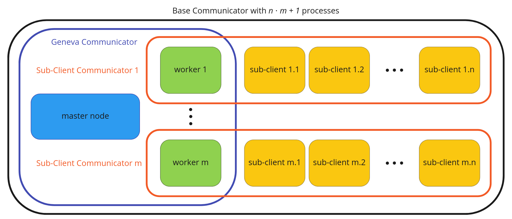

# MPI Sub-Clients


This example shows how to use the GMPISubClientOptimizer.
It offers all functionality of Go2 but additionally adds the functionality of
creating MPI-sub-clients, which can be used to parallelize computation on the level of individuals in a user-defined fashion.

You can set the size of the sub-client networks via the `subClientGroupSize` parameter in the
`GMPISubClientOptimizer.json` config file.

In the following Figure we see how the network looks line when using a `subClientGroupSize` of n.  
The rounded rectangles represent the MPI-communicators:
- Black: The base communicator. This defaults to MPI_COMM_WORLD. However, the user can set this communicator to a sub-communicator if the user himself uses MPI in his application specific code apart from Geneva.
- Blue: The Geneva communicator. This is the communicator which is used for transmitting individuals between master node and worker nodes.
- Orange: The sub-client communicators 1-m. The subgroups have a size of n which can be configured through the configuration file of `GMPISubClientOptimizer`. The number of subgroups will be calculated based on the size of the subgroups and the number of processes in the base communicator. Each subgroup can use MPI in a user-defined fashion in order to parallelize at the level of individuals (i.e. parallelize the fitnessCalculation function).



The executable can be started as follows:

```
mpirun --oversubscribe -np <1 + number of clients * subgroup-size> ./GMPISubClients --consumer mpi
```


For example to run this example with 1 server, 4 clients and 3 sub-clients for each client set the `subClientGroupSize` parameter in the config file to 4 (1 client + 3 sub-clients) and start it with:

```
mpirun --oversubscribe -np 17 ./GMPISubClients --consumer mpi 
```

