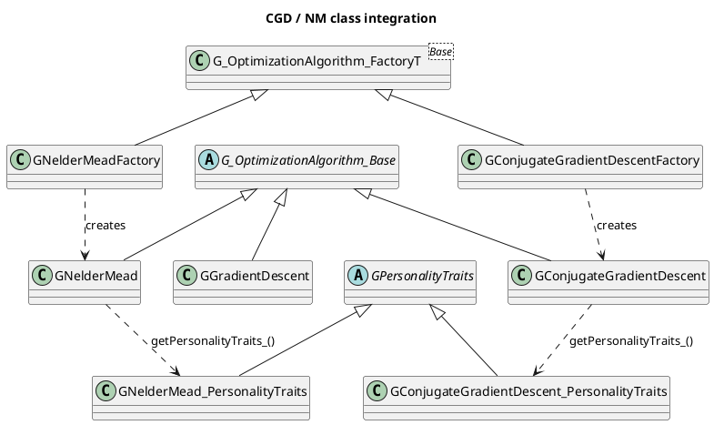
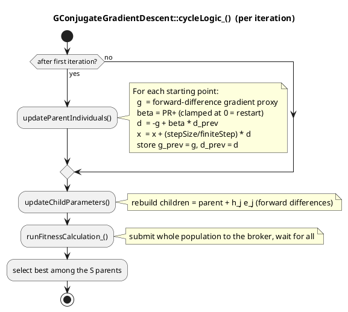
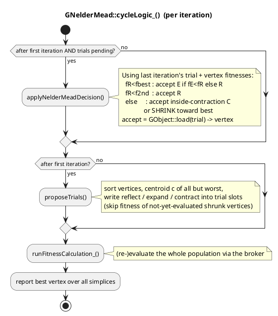
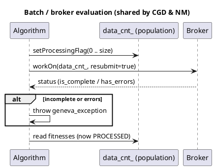

# Geneva — Local Optimizers: Conjugate Gradient Descent & Nelder-Mead Simplex

**Date**: 2026-05-16
**Branch**: `core-component-modernization`
**Status**: Draft implementations, compiled, registered and validated end-to-end against `01_GSimpleOptimizer`. No error/Hessian computation yet (deliberately out of scope for this first step).

---

## 1. Motivation

Population-based optimizers (EA, swarm, SA) are excellent at escaping local minima but
converge slowly and imprecisely in the convex neighbourhood of the optimum, and they
provide no error estimate. The classic remedy is *algorithm chaining*: run a global
search first, then hand the best individual to a fast local optimizer for refinement.
Geneva already supports chaining several algorithms; these two new algorithms add the
local-refinement building blocks:

* **`cgd` — Conjugate Gradient Descent**: a fast local optimizer for *differentiable*
  (smooth) objective functions. Gradients are approximated purely by difference
  quotients of the evaluation function — no analytic gradient is required.
* **`nm` — Nelder-Mead Simplex**: a derivative-free local optimizer for
  *non-differentiable* (and moderately noisy) objective functions, where a gradient
  method is inappropriate.

Both are drop-in siblings of the existing `gd` (`GGradientDescent`) and reuse its
architecture, so a user can swap algorithms simply by changing the `-a` mnemonic.

A future step (explicitly **not** in this deliverable) is to derive a covariance /
error matrix from the curvature information that an L-BFGS-style method accumulates;
the chosen design keeps that door open.

> Recommended chain once error bars are wanted later:
> `EA (global) → CGD/L-BFGS (local refinement + curvature) → error calculation`.

---

## 2. Conjugate Gradient Descent (`cgd`)

### 2.1 Theory

Non-linear conjugate gradient with the **Polak-Ribière+** update. At step *k*:

```
g_k     = forward-difference gradient at the current point
beta_k  = max(0,  g_k · (g_k − g_{k−1}) / (g_{k−1} · g_{k−1}))     (PR+)
d_k     = −g_k + beta_k · d_{k−1}            (d_0 = −g_0; restart ⇒ d_k = −g_k)
x_{k+1} = x_k + λ · d_k
```

The `max(0, …)` clamp (PR+) is an automatic restart that keeps the method globally
convergent; a non-positive / numerically unstable denominator also forces a restart
(`beta = 0`, i.e. a plain steepest-descent step).

### 2.2 Geneva integration

The population layout is **identical to `GGradientDescent`**:

```
nStartingPoints · (nFPParms + 1) individuals

[ P_0 … P_{S-1} | C_{0,0} … C_{0,n-1} | C_{1,0} … | … ]
   parents          difference-quotient children of P_0, P_1, …
```

* Index `i` (`0 … S−1`) — the current point ("parent") of starting point *i*.
* Index `S + i·n + j` — a copy of parent *i* with active parameter *j* incremented by
  the range-scaled finite step `h_j` (a **forward** difference quotient).

The proxy gradient component is `g_j = f(x + h_j e_j) − f(x)` (the same proxy used by
`GGradientDescent`, i.e. *not* divided by `h_j`, so the effective scaling matches the
plain gradient descent). The step is `x ← x + (stepSize/finiteStep) · d`.

**Line-search approximation**: a fixed, range-scaled step is used instead of a Wolfe
line search. A proper line search would require *sequential* extra evaluations along
`d_k`, which does not fit Geneva's batch/broker model (one whole-population submission
per iteration). This is the same approximation philosophy as `GGradientDescent` and is
why the algorithm is labelled *approximate*.

Per-starting-point CG memory (`g_{k−1}`, `d_{k−1}`, a "history valid" flag) is held in
transient member vectors. Like `adjustedFiniteStep_` in `GGradientDescent`, this state
is recomputed during optimization and therefore neither serialized nor restored in
`load_()`.

**Numerical stability of the β division**: the PR+ denominator
`g_{k−1}·g_{k−1}` becomes vanishingly small near convergence; dividing by a tiny
(but positive) value would blow β up and destabilise the search direction. The code
therefore restarts (β = 0, i.e. a steepest-descent step) unless the denominator is
(a) above the absolute representable floor (`numeric_limits<long double>::min()`)
**and** (b) large enough relative to the numerator that the quotient stays below a
finite conjugate-weight cap — the condition `denominator · βmax > |numerator|`
guarantees `|β| < βmax` (with `βmax = 1e4`) by construction. The final step is
additionally wrapped in a `std::overflow_error` guard. `stepRatio =
stepSize/finiteStep` cannot divide by zero because `finiteStep` is validated `> 0`.

### 2.3 Configuration (`./config/GConjugateGradientDescent.json`, auto-generated)

| Option | Default | Meaning |
|---|---|---|
| `nStartingPoints` | 1 | Number of simultaneous, independent CG descents |
| `finiteStep` | 0.001 | Difference-quotient step, in per-mille of each parameter's range |
| `stepSize` | 0.1 | Step length along the conjugate direction, in per-mille of the range |

`stepSize` is the dominant tuning knob (see §5): the default is deliberately
conservative; larger values converge dramatically faster on smooth problems.

### 2.4 Diagrams





### 2.5 Known limitations / future work

* Forward (not central) differences — cheaper (matches `GGradientDescent`'s
  population layout) but `O(h)` accurate. Central differences `(f(x+h)−f(x−h))/2h`
  would double the population to `S·(2n+1)` and are a natural future upgrade.
* No real line search → fixed step; convergence speed is `stepSize`-sensitive.
* Constrained parameters are handled implicitly by `GParameterSet`'s
  transfer/clamping on `assignValueVector`; no explicit unbounded transform yet.
* Natural evolution: replace the fixed step + PR+ direction with **L-BFGS**, whose
  accumulated inverse-Hessian approximation yields the covariance matrix "for free"
  (the basis for a later error-calculation step).

---

## 3. Nelder-Mead Simplex (`nm`)

### 3.1 Theory

Derivative-free downhill simplex. In *n* dimensions a simplex has *n+1* vertices.
Each iteration sorts the vertices, forms the centroid `c` of all but the worst vertex
`x_w`, and tries, in the classical order:

```
reflection   x_r = c + α (c − x_w)
expansion    x_e = c + γ (c − x_w)
contraction  x_c = c + ρ (x_w − c)        (inside contraction)
shrink       x_v ← x_best + σ (x_v − x_best)   for every vertex v ≠ best
```

with the standard acceptance rules (accept expansion if it beats reflection and
reflection beats the best; accept reflection if it beats the second-worst; otherwise
contract; if contraction fails, shrink).

### 3.2 Geneva integration

Because Geneva evaluates a *fixed population per iteration*, the inherently
*sequential* simplex moves are mapped onto a **speculative batch** scheme. Per simplex
the population block is:

```
[ v_0 … v_n | reflect | expand | contract ]      block size = n + 4
nSimplices such blocks run simultaneously (analogous to GD's starting points).
```

Every iteration the reflection, expansion and inside-contraction candidates are
proposed and submitted **together with** the vertices; the Nelder-Mead acceptance
rules are applied in the *next* iteration once their fitnesses are known. This
introduces a deliberate **one-iteration evaluation lag** — exactly the same
approximation style `GGradientDescent` uses for its difference quotients — and still
converges to a local optimum with no gradient information.

Accepting a trial is done via `GObject::load()`, so the chosen vertex inherits the
trial's *already-known* fitness; this keeps the in-iteration ranking consistent.
After a **shrink**, the shrunk vertices have changed parameters but no fitness yet;
`proposeTrials()` detects such not-yet-re-evaluated vertices
(`is_due_for_processing()`) and treats them as "worst" until the subsequent
`runFitnessCalculation_()` restores a valid ranking.

### 3.3 Configuration (`./config/GNelderMead.json`, auto-generated)

| Option | Default | Meaning |
|---|---|---|
| `nSimplices` | 1 | Number of simultaneous, independent simplices |
| `alpha` | 1.0 | Reflection coefficient (> 0) |
| `gamma` | 2.0 | Expansion coefficient (> 1) |
| `rho` | 0.5 | Contraction coefficient (∈ ]0,1[) |
| `sigma` | 0.5 | Shrink coefficient (∈ ]0,1[) |
| `initialEdge` | 0.1 | Initial simplex edge as a fraction of each parameter's range |

### 3.4 Diagram





### 3.5 Known limitations / future work

* **Outside** contraction is not separately evaluated (only inside contraction);
  it is approximated by the reflection/inside-contraction pair. Adding a 4th trial
  slot would make this exact.
* The one-iteration lag means a trial proposed around iteration *k*'s simplex is
  applied at iteration *k+1*; convergence is slightly slower than textbook
  sequential Nelder-Mead but robust within the batch model.
* Constrained parameters are handled implicitly by `GParameterSet` clamping; no
  explicit unbounded transform.
* No restart heuristic on simplex degeneracy yet (the classical "oriented restart").

---

## 4. Usage

Both algorithms are auto-registered with `Go2` and selected by mnemonic:

```bash
# Conjugate gradient descent
./GSimpleOptimizer -a "cgd"

# Nelder-Mead simplex
./GSimpleOptimizer -a "nm"

# Chaining example: global EA, then local refinement
./GSimpleOptimizer -a "ea,cgd"
./GSimpleOptimizer -a "ea,nm"
```

`./GSimpleOptimizer --help` lists all 7 registered algorithms (`cgd`, `ea`, `gd`,
`nm`, `ps`, `sa`, `swarm`). Each algorithm reads/auto-generates its own JSON config
under `./config/`.

---

## 5. Validation

Built in **Release** mode (GCC 15.2, `-O3 -DNDEBUG`, C++20); the geneva library,
`geneva-individuals` and `01_GSimpleOptimizer` compile and link with **0 warnings,
0 errors**. Default problem: 2-D parabola (minimum at the origin).

| Run | Result (raw fitness) | Notes |
|---|---|---|
| `nm` (before flag fix) | reached 4.6e-34 then **threw** at iter 147 | degenerate-simplex read bug |
| `nm` (after fix) | **3.5e-244** (params ≈ 1e-123) | converges to machine zero, no exception |
| `cgd` (default `stepSize=0.1`) | 0.0666 after 1000 it | monotone decrease — conservative default |
| `cgd` (`stepSize=5.0`) | **2e-10** (params ≈ 1e-5) | confirms the CG logic is correct |

The single bug found during validation (Nelder-Mead reading the fitness of a
vertex that a same-iteration shrink had invalidated) was fixed by guarding that read
with `is_due_for_processing()`.

---

## 6. Files added & registration touch-points

New files (each algorithm mirrors the `GGradientDescent` trio):

```
include/geneva/G_OptimizationAlgorithm_ConjugateGradientDescent.hpp
include/geneva/G_OptimizationAlgorithm_ConjugateGradientDescent_Factory.hpp
include/geneva/G_OptimizationAlgorithm_ConjugateGradientDescent_PersonalityTraits.hpp
src/geneva/G_OptimizationAlgorithm_ConjugateGradientDescent.cpp
src/geneva/G_OptimizationAlgorithm_ConjugateGradientDescent_Factory.cpp
src/geneva/G_OptimizationAlgorithm_ConjugateGradientDescent_PersonalityTraits.cpp
include/geneva/G_OptimizationAlgorithm_NelderMead.hpp
include/geneva/G_OptimizationAlgorithm_NelderMead_Factory.hpp
include/geneva/G_OptimizationAlgorithm_NelderMead_PersonalityTraits.hpp
src/geneva/G_OptimizationAlgorithm_NelderMead.cpp
src/geneva/G_OptimizationAlgorithm_NelderMead_Factory.cpp
src/geneva/G_OptimizationAlgorithm_NelderMead_PersonalityTraits.cpp
```

Modified for registration / build:

* `src/geneva/CMakeLists.txt`, `include/geneva/CMakeLists.txt` — added the 12 sources/headers.
* `include/geneva/Go2.hpp` — `#include` the two new factory headers.
* `src/geneva/Go2.cpp` — `gi_.registerOAF<GConjugateGradientDescentFactory>();` and
  `gi_.registerOAF<GNelderMeadFactory>();` in the `Go2` constructor.

Mnemonics: `cgd` / `nm` (set as the `nickname` in the respective PersonalityTraits
`.cpp`). Personality-type strings: `PERSONALITY_CGD` / `PERSONALITY_NM`. Serialization
uses the per-class `BOOST_CLASS_EXPORT_KEY`/`IMPLEMENT` pattern (algorithm class and
its PersonalityTraits class), exactly as `GGradientDescent`.

---

## 7. Outlook: error calculation (not implemented here)

The longer-term goal is an integrated error/covariance estimate. The most promising
path is to evolve `cgd` into **L-BFGS**, which maintains a compact approximation of the
inverse Hessian from the last *m* steps. After convergence that approximation *is* the
covariance matrix (symmetric errors come for free; MINOS-style asymmetric errors via
profile minimizations, themselves run with the same fast local optimizer). The current
CGD/NM split deliberately keeps the architecture (population layout, transient
per-start state, batch evaluation) ready for that extension.
